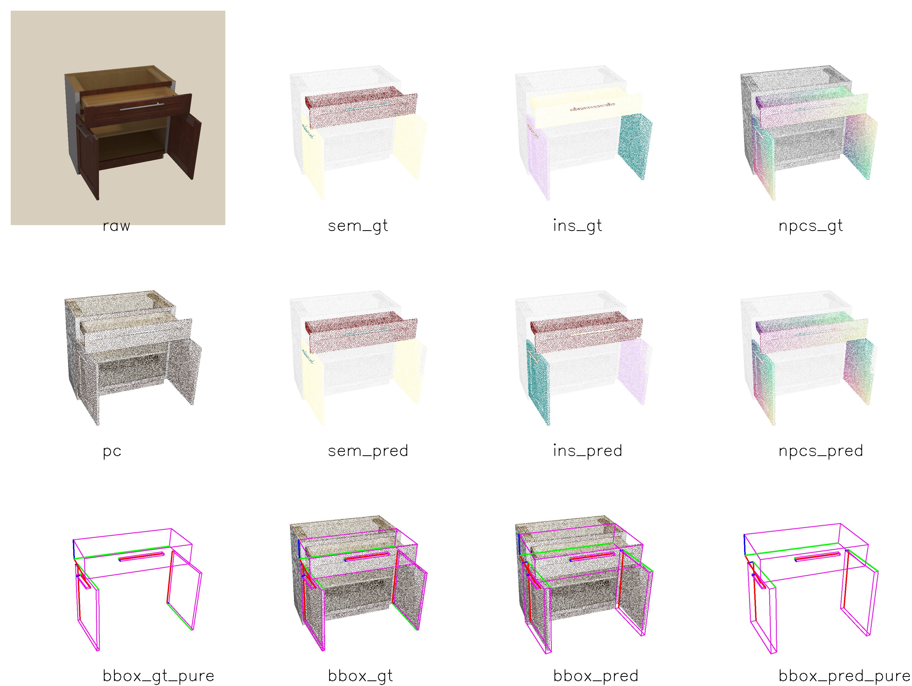
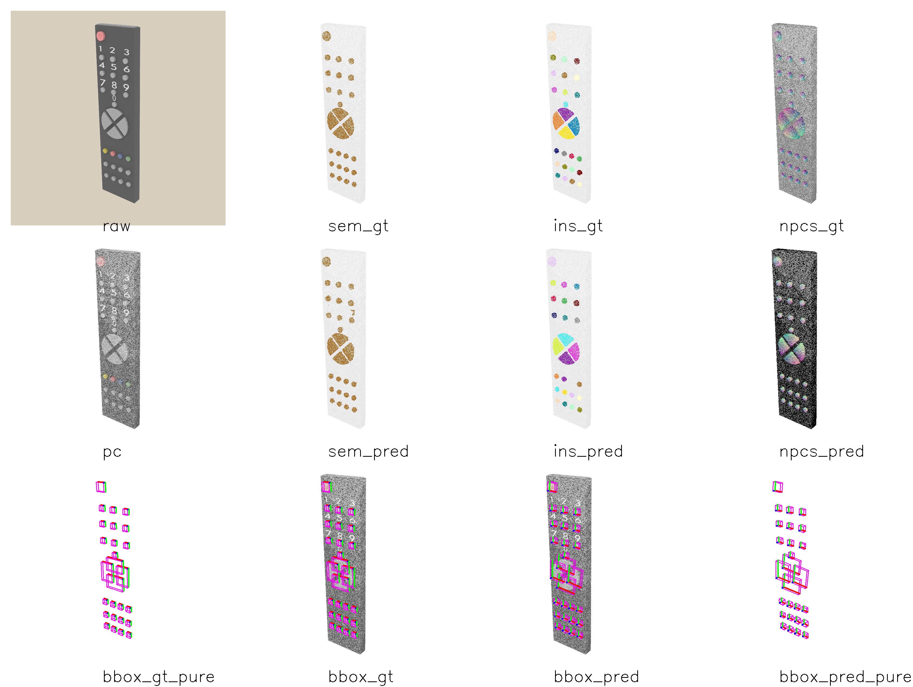

<h2 align="center">
  <b>GAPartNet: Cross-Category Domain-Generalizable Object Perception and Manipulation via Generalizable and Actionable Parts</b>

  <b><i>CVPR 2023 Highlight</i></b>


<div align="center">
    <a href="https://cvpr.thecvf.com/virtual/2023/poster/22552" target="_blank">
    </a>
    <a href="https://arxiv.org/abs/2211.05272" target="_blank">
    </a>
    <a href="https://pku-epic.github.io/GAPartNet/" target="_blank">
    </a>
</div>
</h2>

This is the official repository of [**GAPartNet: Cross-Category Domain-Generalizable Object Perception and Manipulation via Generalizable and Actionable Parts**](https://arxiv.org/abs/2211.05272).

For more information, please visit our [**project page**](https://pku-epic.github.io/GAPartNet/).


## 💡 News
- `2024/3/5` We added some example assets in `example_assets` and wrote some usage demos in `demo.ipynb`.

- `2023/6/28` We polish our model with the user-friendly Lightning framework and release detailed training code! Check the gapartnet folder for more details!

- `2023/5/21` GAPartNet Dataset has been released, including Object & Part Assets and Annotations, Rendered PointCloud Data and our Pre-trained Checkpoint.

## GAPartNet Dataset

(New!) GAPartNet Dataset has been released, including Object & Part Assets and Annotations, Rendered PointCloud Data, and our Pre-trained Checkpoint.

To obtain our dataset, please fill out [**this form**](https://forms.gle/3qzv8z5vP2BT5ARN7) and check the [**Terms&Conditions**](https://docs.google.com/document/d/1kjFCTcDLtaycZiJVmSVhT9Yw8oCAHl-3XKdJapvRdW0/edit?usp=sharing). Please cite our paper if you use our dataset.

Download our pretrained checkpoint [**here**](https://drive.google.com/file/d/1D1PwfXPYPtxadthKAJdehhIBbPEyBB6X/view?usp=sharing)! 
We also release the checkpoint trained on all the GAPartNet dataset with the best performance [**here**](https://drive.google.com/file/d/1TzsVKVlbqRg3fd3XEutQ2jgTH07Q8Lad/view?usp=sharing)
(Notice that the checkpoint in the dataset is expired, please use this one.)

## GAPartNet Network and Inference

We release our network and checkpoints; check the gapartnet folder for more details. You can segment parts 
and estimate the pose of it. We also provide visualization code. This is a visualization example:



## How to use our code and model: 

### 1. Install dependencies
  - Python 3.8
  - Pytorch >= 1.11.0
  - CUDA >= 11.3
  - Open3D with extension (See install guide below)
  - epic_ops (See install guide below)
  - pointnet2_ops (See install guide below)
  - other pip packages

### 2. Install Open3D & epic_ops & pointnet2_ops
  See this repo for more details:
  
  [GAPartNet_env](https://github.com/geng-haoran/GAPartNet_env): This repo includes Open3D, [epic_ops](https://github.com/geng-haoran/epic_ops) and pointnet2_ops. You can install them by following the instructions in this repo.

### 3. Download our model and data
  See gapartnet folder for more details.

### 4. Inference and visualization
  ```
  cd gapartnet

  CUDA_VISIBLE_DEVICES=0 \
  python train.py test -c gapartnet.yaml \
  --model.init_args.training_schedule "[0,0]" \
  --model.init_args.ckpt ckpt/release.ckpt
  ```
Notice:
- We provide visualization code here, you can change cfg in `model.init_args.visualize_cfg` and control
  - whether to visualize (visualize)
  - where to save results (SAVE_ROOT)
  - what to visualize: save_option includes `["raw", "pc", "sem_pred", "sem_gt", "ins_pred", "ins_gt", "npcs_pred", "npcs_gt", "bbox_gt", "bbox_gt_pure", "bbox_pred", "bbox_pred_pure"]` (save_option)
  - the number of visualization samples (sample_num)
- We fix some bugs for mAP computation, check the code for more details.

### 5. Training
  You can run the following code to train the policy:
  ```
  cd gapartnet

  CUDA_VISIBLE_DEVICES=0 \
  python train.py fit -c gapartnet.yaml
  ```
Notice:
- For training, please use a good schedule, first train the semantic segmentation backbone and head, then, add the clustering and scorenet supervision for instance segmentation. You can change the schedule in cfg(`model.init_args.training_schedule`). The schedule is a list, the first number indicate the epoch to start the clustering and scorenet training, the second number indicate the epoch to start the npcsnet training. For example, [5,10] means that the clustering and scorenet training will start at epoch 5, and the npcsnet training will start at epoch 10.
- If you want to debug, add `--model.init_args.debug True` to the command and also change `data.init_args.xxx_few_shot` in the cfg to be `True`, here `xxx` is the name of training and validation sets.
- We also provide multi-GPU parallel training, please set `CUDA_VISIBLE_DEVICES` to be the GPUs you want to use, e.g. `CUDA_VISIBLE_DEVICES=3,6` means you want to use 2 GPU #3 and #6 for training.

## Citation
If you find our work useful in your research, please consider citing:

```
@article{geng2022gapartnet,
  title={GAPartNet: Cross-Category Domain-Generalizable Object Perception and Manipulation via Generalizable and Actionable Parts},
  author={Geng, Haoran and Xu, Helin and Zhao, Chengyang and Xu, Chao and Yi, Li and Huang, Siyuan and Wang, He},
  journal={arXiv preprint arXiv:2211.05272},
  year={2022}
}
```

## Contact
If you have any questions, please open a github issue or contact us:

Haoran Geng: ghr@stu.pku.edu.cn

Helin Xu: xuhelin1911@gmail.com

Chengyang Zhao: zhaochengyang@pku.edu.cn

He Wang: hewang@pku.edu.cn
